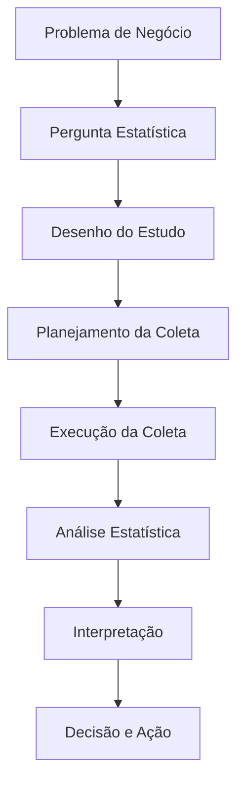

# Desenho e Condução de Experimentos e Análises Estatísticas

## 📋 Framework Completo do Processo Estatístico

### **Fluxo Detalhado das 8 Etapas do Processo Estatístico**



---

## 🎯 **ETAPA 1: Formulação da Pergunta de Negócio**

### **Teoria: Transformando Problemas em Perguntas Mensuráveis**

**Problema de Negócio vs Pergunta Estatística:**
- **Problema**: "As vendas estão caindo"
- **Pergunta Estatística**: "Há uma redução significativa nas vendas médias mensais no último trimestre comparado ao mesmo período do ano anterior?"

**Componentes de uma Boa Pergunta Estatística:**
- Específica e mensurável
- Define população e variáveis
- Esclarece o tipo de comparação/relação
- Considera contexto temporal

### **Exemplo Prático na Padaria**
```python
# Framework para refinar perguntas de negócio
def refinar_pergunta(problema_negocio):
    """
    Transforma problemas vagos em perguntas estatísticas específicas
    """
    mapeamento_perguntas = {
        # Problema -> Pergunta Estatística
        "vendas baixas": "Qual é a diferença nas vendas médias diárias entre produtos premium e standard?",
        "clientes insatisfeitos": "Qual é a proporção de clientes que classificam o atendimento como 'insatisfatório'?",
        "lucro reduzido": "Existe correlação entre o aumento dos custos de ingredientes e a redução da margem de lucro?"
    }
    return mapeamento_perguntas.get(problema_negocio, problema_negocio)

# Aplicação
problema = "os pães não estão ficando com a qualidade esperada"
pergunta_estatistica = refinar_pergunta(problema)
print(f"Problema: {problema}")
print(f"Pergunta Estatística: {pergunta_estatistica}")
```

---

## 🔬 **ETAPA 2: Desenho do Estudo ou Experimento**

### **Teoria: Escolhendo o Desenho Apropriado**

#### **2.1 Estudos Observacionais vs Experimentais**

| **Característica** | **Observacional** | **Experimental** |
|-------------------|-------------------|------------------|
| **Intervenção** | Nenhuma | Manipulação ativa |
| **Causalidade** | Associação apenas | Pode inferir causalidade |
| **Controle** | Limitado | Alto controle |
| **Viés** | Potencialmente alto | Controlado via randomização |

#### **2.2 Tipos de Desenho Observacional**
- **Transversal**: Mede tudo em um único momento
- **Longitudinal**: Segue os mesmos indivíduos ao longo do tempo
- **Caso-Controle**: Compara casos com controles

#### **2.3 Elementos de um Bom Experimento**
- **Randomização**: Atribuição aleatória a grupos
- **Controle**: Grupo de comparação
- **Replicação**: Múltiplas unidades experimentais
- **Blocagem**: Controlar fontes conhecidas de variação

### **Exemplo Prático: Desenhando um Experimento na Padaria**
```python
import random
from datetime import datetime, timedelta

class DesignerExperimental:
    def __init__(self):
        self.grupos = {}
        
    def desenhar_experimento_ab(self, pergunta, variavel_independente, variavel_dependente):
        """
        Desenha um experimento A/B teste
        """
        desenho = {
            'pergunta': pergunta,
            'variavel_independente': variavel_independente,
            'variavel_dependente': variavel_dependente,
            'grupos': {},
            'duracao': None,
            'metrica_primaria': None
        }
        return desenho

# Aplicação: Testando novo cardápio
designer = DesignerExperimental()

experimento_cardapio = designer.desenhar_experimento_ab(
    pergunta="O novo cardápio com fotos aumenta o ticket médio?",
    variavel_independente="Tipo de cardápio (com fotos vs sem fotos)",
    variavel_dependente="Ticket médio (R$)"
)

# Adicionando detalhes do desenho
experimento_cardapio['grupos'] = {
    'controle': {
        'descricao': 'Cardápio tradicional (sem fotos)',
        'n_mesas': 15,
        'alocacao': 'aleatoria'
    },
    'tratamento': {
        'descricao': 'Cardápio com fotos dos produtos',
        'n_esmas': 15,
        'alocacao': 'aleatoria'
    }
}

experimento_cardapio['duracao'] = '30 dias'
experimento_cardapio['metrica_primaria'] = 'Ticket médio por mesa'
experimento_cardapio['metricas_secundarias'] = [
    'Tempo de permanência na mesa',
    'Número de itens pedidos por mesa',
    'Satisfação do cliente (pesquisa)'
]

print("🎯 Desenho Experimental Criado:")
for chave, valor in experimento_cardapio.items():
    print(f"{chave}: {valor}")
```

---

## 📊 **ETAPA 3: Planejamento da Coleta de Dados**

### **Teoria: Amostragem e Tamanho Amostral**

#### **3.1 Métodos de Amostragem**

**Probabilísticos (Inferência Válida):**
- **Aleatória Simples**: Cada elemento tem igual probabilidade
- **Estratificada**: Divide população em estratos, amostra de cada um
- **Por Conglomerados**: Amostra grupos naturais

**Não Probabilísticos (Inferência Limitada):**
- **Conveniência**: Fácil acesso
- **Voluntários**: Auto-seleção

#### **3.2 Cálculo de Tamanho Amostral**

**Fórmulas Principais:**
- **Média**: n = (Z² × σ²) / E²
- **Proporção**: n = (Z² × p × (1-p)) / E²

### **Exemplo Prático: Planejamento Amostral**
```python
import math
from scipy import stats

class PlanejadorAmostral:
    def __init__(self):
        self.niveis_confianca = {
            90: 1.645,
            95: 1.960,
            99: 2.576
        }
    
    def calcular_tamanho_amostra_media(self, desvio_padrao, margem_erro, confianca=95):
        """Calcula tamanho amostral para estimar média"""
        z = self.niveis_confianca[confianca]
        n = (z**2 * desvio_padrao**2) / margem_erro**2
        return math.ceil(n)
    
    def calcular_tamanho_amostra_proporcao(self, proporção_esperada, margem_erro, confianca=95):
        """Calcula tamanho amostral para estimar proporção"""
        z = self.niveis_confianca[confianca]
        n = (z**2 * proporção_esperada * (1 - proporção_esperada)) / margem_erro**2
        return math.ceil(n)
    
    def criar_plano_coleta(self, desenho_experimental):
        """Cria plano detalhado de coleta de dados"""
        plano = {
            'unidade_amostral': None,
            'tamanho_amostra': None,
            'periodo_coleta': None,
            'instrumentos_coleta': [],
            'protocolo_qualidade': []
        }
        return plano

# Aplicação na Padaria
planejador = PlanejadorAmostral()

# Calculando tamanho amostral para pesquisa de satisfação
n_satisfacao = planejador.calcular_tamanho_amostra_proporcao(
    proporção_esperada=0.5,  # Mais conservador
    margem_erro=0.05,       # 5% de margem de erro
    confianca=95            # 95% de confiança
)

print(f"📊 Tamanho amostral necessário: {n_satisfacao} clientes")

# Plano de coleta detalhado
plano_coleta = planejador.criar_plano_coleta(experimento_cardapio)
plano_coleta.update({
    'unidade_amostral': 'Mesa por turno',
    'tamanho_amostra': f"{n_satisfacao} mesas no total",
    'periodo_coleta': '30 dias (4 semanas completas)',
    'instrumentos_coleta': [
        'Sistema de PDV para ticket médio',
        'Relógio ponto para tempo permanência',
        'Questionário de satisfação (escala 1-5)'
    ],
    'protocolo_qualidade': [
        'Treinamento de garçons para consistência',
        'Verificação diária de dados',
        'Backup automático dos dados'
    ]
})

print("\n📋 Plano de Coleta de Dados:")
for chave, valor in plano_coleta.items():
    print(f"{chave}: {valor}")
```

---

## 🔍 **ETAPA 4: Execução da Coleta de Dados**

### **Teoria: Protocolos e Controle de Qualidade**

**Princípios de Boa Coleta:**
- **Consistência**: Mesmo protocolo para todas observações
- **Precisão**: Instrumentos calibrados e validados
- **Integridade**: Dados completos sem valores missing
- **Documentação**: Metadados e procedimentos registrados

### **Exemplo Prático: Sistema de Coleta**
```python
import pandas as pd
from datetime import datetime, timedelta
import time

class ColetorDados:
    def __init__(self):
        self.dados = pd.DataFrame()
        self.log_erros = []
    
    def simular_coleta_experimento(self, desenho_experimental, duracao_dias=30):
        """Simula coleta de dados de um experimento A/B"""
        print("🔄 Iniciando coleta de dados...")
        
        dados_coletados = []
        data_inicio = datetime.now()
        
        for dia in range(duracao_dias):
            data_coleta = data_inicio + timedelta(days=dia)
            
            # Simular dados para grupo controle
            for mesa in range(desenho_experimental['grupos']['controle']['n_mesas']):
                ticket_medio = np.random.normal(45, 8)  # R$ 45 ± 8
                tempo_permanencia = np.random.normal(35, 10)  # 35 ± 10 min
                satisfacao = np.random.randint(3, 6)  # 3-5
                
                dados_coletados.append({
                    'data': data_coleta,
                    'grupo': 'controle',
                    'mesa': f"C{mesa:02d}",
                    'ticket_medio': max(20, ticket_medio),  # Mínimo R$ 20
                    'tempo_permanencia': max(15, tempo_permanencia),
                    'satisfacao': satisfacao,
                    'turno': 'manha' if mesa < 8 else 'tarde'
                })
            
            # Simular dados para grupo tratamento
            for mesa in range(desenho_experimental['grupos']['tratamento']['n_mesas']):
                # Efeito tratamento: ticket 15% maior em média
                ticket_medio = np.random.normal(52, 9)  # R$ 52 ± 9
                tempo_permanencia = np.random.normal(38, 12)  # 38 ± 12 min
                satisfacao = np.random.randint(4, 6)  # 4-5
                
                dados_coletados.append({
                    'data': data_coleta,
                    'grupo': 'tratamento',
                    'mesa': f"T{mesa:02d}",
                    'ticket_medio': max(20, ticket_medio),
                    'tempo_permanencia': max(15, tempo_permanencia),
                    'satisfacao': satisfacao,
                    'turno': 'manha' if mesa < 8 else 'tarde'
                })
            
            # Progresso
            if (dia + 1) % 7 == 0:
                print(f"✅ Semana {(dia + 1) // 7} completada")
        
        self.dados = pd.DataFrame(dados_coletados)
        print(f"🎉 Coleta concluída! {len(self.dados)} registros coletados")
        return self.dados

# Executando a coleta
coletor = ColetorDados()
dados_experimento = coletor.simular_coleta_experimento(experimento_cardapio)

# Verificação de qualidade dos dados
print("\n🔍 Verificação de Qualidade dos Dados:")
print(f"Total de registros: {len(dados_experimento)}")
print(f"Valores missing: {dados_experimento.isnull().sum().sum()}")
print(f"Distribuição por grupo:")
print(dados_experimento['grupo'].value_counts())

# Estatísticas descritivas iniciais
print("\n📈 Estatísticas Descritivas por Grupo:")
estatisticas_grupo = dados_experimento.groupby('grupo').agg({
    'ticket_medio': ['mean', 'std', 'count'],
    'tempo_permanencia': ['mean', 'std'],
    'satisfacao': ['mean', 'std']
}).round(2)

print(estatisticas_grupo)
```

---

## 📈 **ETAPA 5: Análise Estatística**

### **Teoria: Escolhendo a Análise Apropriada**

**Framework de Decisão para Análise:**

| **Pergunta** | **Variáveis** | **Análise** | **Premissas** |
|-------------|---------------|-------------|---------------|
| Diferença entre 2 grupos? | 1 quanti + 1 categ (2 níveis) | Teste t | Normalidade, homocedasticidade |
| Diferença entre 3+ grupos? | 1 quanti + 1 categ (3+ níveis) | ANOVA | Normalidade, homocedasticidade |
| Relação entre 2 variáveis? | 2 quantitativas | Correlação/Regressão | Linearidade, independência |
| Associação categórica? | 2 categóricas | Qui-quadrado | Tamanho amostral suficiente |
| Previsão com múltiplos fatores? | 1 quanti + múltiplas vars | Regressão Múltipla | Multicolinearidade, resíduos normais |

### **Exemplo Prático: Análise do Experimento**
```python
class AnalisadorExperimental:
    def __init__(self, dados):
        self.dados = dados
        self.resultados = {}
    
    def analisar_experimento_ab(self, variavel_resposta, grupo_tratamento='tratamento', grupo_controle='controle'):
        """Executa análise completa de experimento A/B"""
        
        # Dados dos grupos
        dados_tratamento = self.dados[self.dados['grupo'] == grupo_tratamento][variavel_resposta]
        dados_controle = self.dados[self.dados['grupo'] == grupo_controle][variavel_resposta]
        
        # Estatísticas descritivas
        descritivas = {
            'tratamento': {
                'n': len(dados_tratamento),
                'media': dados_tratamento.mean(),
                'desvio_padrao': dados_tratamento.std(),
                'erro_padrao': dados_tratamento.std() / np.sqrt(len(dados_tratamento))
            },
            'controle': {
                'n': len(dados_controle),
                'media': dados_controle.mean(),
                'desvio_padrao': dados_controle.std(),
                'erro_padrao': dados_controle.std() / np.sqrt(len(dados_controle))
            }
        }
        
        # Teste de hipótese - Teste t para duas amostras independentes
        from scipy.stats import ttest_ind, levene
        
        # Verificar homogeneidade de variâncias
        stat_levene, p_levene = levene(dados_tratamento, dados_controle)
        variancias_iguais = p_levene > 0.05
        
        # Teste t
        t_stat, p_value = ttest_ind(
            dados_tratamento, 
            dados_controle, 
            equal_var=variancias_iguais,
            alternative='greater'  # Teste unilateral: tratamento > controle
        )
        
        # Tamanho do efeito (Cohen's d)
        n1, n2 = len(dados_tratamento), len(dados_controle)
        s_pooled = np.sqrt(((n1-1)*dados_tratamento.std()**2 + (n2-1)*dados_controle.std()**2) / (n1+n2-2))
        cohens_d = (dados_tratamento.mean() - dados_controle.mean()) / s_pooled
        
        # Intervalo de confiança para diferença
        from scipy.stats import t
        diferenca_media = dados_tratamento.mean() - dados_controle.mean()
        erro_padrao_diferenca = s_pooled * np.sqrt(1/n1 + 1/n2)
        df = n1 + n2 - 2
        t_critico = t.ppf(0.975, df)  # 95% CI
        ic_inferior = diferenca_media - t_critico * erro_padrao_diferenca
        ic_superior = diferenca_media + t_critico * erro_padrao_diferenca
        
        self.resultados = {
            'descritivas': descritivas,
            'teste_hipotese': {
                't_statistic': t_stat,
                'p_value': p_value,
                'variancias_iguais': variancias_iguais,
                'p_value_levene': p_levene
            },
            'tamanho_efeito': {
                'cohens_d': cohens_d,
                'interpretacao': self.interpretar_cohens_d(cohens_d)
            },
            'intervalo_confianca': {
                'diferenca_media': diferenca_media,
                'ic_95_inferior': ic_inferior,
                'ic_95_superior': ic_superior
            }
        }
        
        return self.resultados
    
    def interpretar_cohens_d(self, d):
        """Interpreta o tamanho do efeito de Cohen"""
        if abs(d) < 0.2:
            return "Efeito muito pequeno"
        elif abs(d) < 0.5:
            return "Efeito pequeno"
        elif abs(d) < 0.8:
            return "Efeito médio"
        else:
            return "Efeito grande"
    
    def gerar_relatorio(self):
        """Gera relatório completo da análise"""
        print("📊 RELATÓRIO DE ANÁLISE EXPERIMENTAL")
        print("=" * 50)
        
        # Estatísticas descritivas
        print("\n📈 ESTATÍSTICAS DESCRITIVAS:")
        for grupo in ['tratamento', 'controle']:
            stats = self.resultados['descritivas'][grupo]
            print(f"{grupo.upper()}:")
            print(f"  n = {stats['n']}")
            print(f"  Média = R$ {stats['media']:.2f}")
            print(f"  Desvio Padrão = R$ {stats['desvio_padrao']:.2f}")
            print(f"  Erro Padrão = R$ {stats['erro_padrao']:.2f}")
        
        # Teste de hipótese
        print(f"\n🔬 TESTE DE HIPÓTESE:")
        print(f"  Estatística t = {self.resultados['teste_hipotese']['t_statistic']:.3f}")
        print(f"  Valor-p = {self.resultados['teste_hipotese']['p_value']:.4f}")
        print(f"  Varianças iguais? {self.resultados['teste_hipotese']['variancias_iguais']}")
        
        # Tamanho do efeito
        print(f"\n📏 TAMANHO DO EFEITO:")
        print(f"  Cohen's d = {self.resultados['tamanho_efeito']['cohens_d']:.3f}")
        print(f"  Interpretação: {self.resultados['tamanho_efeito']['interpretacao']}")
        
        # Intervalo de confiança
        print(f"\n🎯 INTERVALO DE CONFIANÇA (95%):")
        ic = self.resultados['intervalo_confianca']
        print(f"  Diferença média = R$ {ic['diferenca_media']:.2f}")
        print(f"  IC = (R$ {ic['ic_95_inferior']:.2f}, R$ {ic['ic_95_superior']:.2f})")
        
        # Conclusão
        print(f"\n✅ CONCLUSÃO:")
        alpha = 0.05
        if self.resultados['teste_hipotese']['p_value'] < alpha:
            print("  REJEITAMOS H₀: Há evidências de que o tratamento tem efeito significativo")
            melhoria_percentual = (ic['diferenca_media'] / self.resultados['descritivas']['controle']['media']) * 100
            print(f"  Melhoria estimada: {melhoria_percentual:.1f}%")
        else:
            print("  NÃO REJEITAMOS H₀: Não há evidências de efeito significativo do tratamento")

# Executando a análise
analisador = AnalisadorExperimental(dados_experimento)
resultados = analisador.analisar_experimento_ab('ticket_medio')
analisador.gerar_relatorio()
```

---

## 🧠 **ETAPA 6: Interpretação dos Resultados**

### **Teoria: Da Significância Estatística ao Significado Prático**

**Princípios de Boa Interpretação:**
1. **Contexto é crucial**: Um resultado estatisticamente significativo pode não ser praticamente importante
2. **Considerar tamanho do efeito**: Além do valor-p
3. **Avaliar incerteza**: Intervalos de confiança fornecem faixa plausível
4. **Verificar premissas**: Resultados válidos dependem de premissas atendidas

### **Exemplo Prático: Interpretação Contextualizada**
```python
class InterpretadorResultados:
    def __init__(self, resultados_analise, contexto_negocio):
        self.resultados = resultados_analise
        self.contexto = contexto_negocio
    
    def analisar_impacto_negocio(self, custo_implementacao=0):
        """Analisa o impacto do resultado no negócio"""
        
        # Dados do experimento
        diff_media = self.resultados['intervalo_confianca']['diferenca_media']
        media_controle = self.resultados['descritivas']['controle']['media']
        n_dias = 30  # Duração do experimento
        n_mesas_dia = 30  # Mesas por dia
        
        # Cálculo do impacto financeiro
        aumento_percentual = (diff_media / media_controle) * 100
        aumento_diario = diff_media * n_mesas_dia
        aumento_mensal = aumento_diario * 30
        aumento_anual = aumento_mensal * 12
        
        # ROI se houver custo de implementação
        if custo_implementacao > 0:
            roi_meses = custo_implementacao / aumento_mensal
        else:
            roi_meses = 0
        
        impacto = {
            'aumento_percentual': aumento_percentual,
            'aumento_diario': aumento_diario,
            'aumento_mensal': aumento_mensal,
            'aumento_anual': aumento_anual,
            'roi_meses': roi_meses,
            'significancia_pratica': self.avaliar_significancia_pratica(aumento_mensal)
        }
        
        return impacto
    
    def avaliar_significancia_pratica(self, aumento_mensal):
        """Avalia se o efeito é praticamente significativo"""
        if aumento_mensal > 1000:
            return "Alta significância prática"
        elif aumento_mensal > 500:
            return "Média significância prática"
        elif aumento_mensal > 100:
            return "Baixa significância prática"
        else:
            return "Significância prática questionável"
    
    def gerar_recomendacao(self, custo_implementacao=0):
        """Gera recomendação baseada nos resultados"""
        
        impacto = self.analisar_impacto_negocio(custo_implementacao)
        p_value = self.resultados['teste_hipotese']['p_value']
        cohens_d = self.resultados['tamanho_efeito']['cohens_d']
        
        print("\n💡 RECOMENDAÇÃO E ANÁLISE DE IMPACTO")
        print("=" * 50)
        
        print(f"\n📊 Resultados Estatísticos:")
        print(f"  Significância estatística: {'SIM' if p_value < 0.05 else 'NÃO'}")
        print(f"  Tamanho do efeito: {cohens_d:.3f} ({self.resultados['tamanho_efeito']['interpretacao']})")
        
        print(f"\n💰 Impacto no Negócio:")
        print(f"  Aumento no ticket médio: {impacto['aumento_percentual']:.1f}%")
        print(f"  Ganho mensal estimado: R$ {impacto['aumento_mensal']:.2f}")
        print(f"  Ganho anual estimado: R$ {impacto['aumento_anual']:.2f}")
        print(f"  Significância prática: {impacto['significancia_pratica']}")
        
        if custo_implementacao > 0:
            print(f"  ROI: {impacto['roi_meses']:.1f} meses para payback")
        
        print(f"\n🎯 Recomendação:")
        if p_value < 0.05 and impacto['significancia_pratica'] != "Significância prática questionável":
            if custo_implementacao == 0 or impacto['roi_meses'] < 6:
                print("  ✅ IMPLEMENTAR: Resultados mostram benefício claro")
            else:
                print("  ⚠️  AVALIAR CUSTO-BENEFÍCIO: ROI mais longo, considerar outros fatores")
        else:
            print("  ❌ NÃO IMPLEMENTAR: Evidências insuficientes de benefício")
            if p_value >= 0.05:
                print("     - Falta significância estatística")
            if impacto['significancia_pratica'] == "Significância prática questionável":
                print("     - Impacto financeiro muito baixo")

# Contexto de negócio da padaria
contexto_padaria = {
    'faturamento_mensal_atual': 50000,
    'margem_lucro': 0.3,
    'custo_cardapio_novo': 800  # Custo para imprimir novos cardápios
}

# Interpretação dos resultados
interpretador = InterpretadorResultados(resultados, contexto_padaria)
interpretador.gerar_recomendacao(custo_implementacao=800)
```

---

## 🚀 **ETAPA 7: Tomada de Decisão e Implementação**

### **Teoria: Do Insight à Ação**

**Framework de Decisão Baseada em Evidências:**
1. **Avaliar certeza**: Qual a confiança nos resultados?
2. **Considerar custos e benefícios**: Análise de ROI
3. **Avaliar riscos**: O que pode dar errado?
4. **Plano de implementação**: Como escalar se funcionar?
5. **Métricas de acompanhamento**: Como monitorar resultados

### **Exemplo Prático: Plano de Implementação**
```python
class PlanoImplementacao:
    def __init__(self, recomendacao, contexto):
        self.recomendacao = recomendacao
        self.contexto = contexto
    
    def criar_plano_rollout(self):
        """Cria plano de implementação em fases"""
        
        plano = {
            'fase_1': {
                'nome': 'Validação Adicional',
                'duracao': '2 semanas',
                'acoes': [
                    'Repetir experimento em outro período',
                    'Testar variações do cardápio',
                    'Coletar feedback qualitativo dos clientes'
                ],
                'metricas': ['Ticket médio', 'Satisfação', 'Feedback qualitativo']
            },
            'fase_2': {
                'nome': 'Implementação Parcial',
                'duracao': '1 mês',
                'acoes': [
                    'Implementar em 50% das mesas',
                    'Treinar equipe completa',
                    'Ajustar baseado em feedback'
                ],
                'metricas': ['Ticket médio', 'Eficiência do serviço', 'Satisfação equipe']
            },
            'fase_3': {
                'nome': 'Implementação Total',
                'duracao': 'Contínuo',
                'acoes': [
                    'Implementar em todas as mesas',
                    'Atualizar todos os cardápios',
                    'Monitoramento contínuo'
                ],
                'metricas': ['Ticket médio', 'Faturamento total', 'Satisfação cliente']
            }
        }
        
        return plano
    
    def criar_plano_monitoramento(self):
        """Cria plano de monitoramento pós-implementação"""
        
        monitoramento = {
            'metricas_chave': {
                'ticket_medio': {
                    'alvo': 'Aumento de 10%',
                    'frequencia': 'Diária',
                    'responsavel': 'Gerente'
                },
                'satisfacao_cliente': {
                    'alvo': 'Manter acima de 4.0',
                    'frequencia': 'Semanal',
                    'responsavel': 'Supervisor'
                },
                'custo_cardapio': {
                    'alvo': 'ROI < 6 meses',
                    'frequencia': 'Mensal',
                    'responsavel': 'Financeiro'
                }
            },
            'gatilhos_acao': {
                'queda_ticket_15%': 'Revisar cardápio e treinamento',
                'satisfacao_abaixo_3.5': 'Pesquisa de causa raíz',
                'custo_aumento_20%': 'Revisar fornecedores'
            }
        }
        
        return monitoramento

# Criando plano de implementação
plano = PlanoImplementacao("IMPLEMENTAR", contexto_padaria)
plano_rollout = plano.criar_plano_rollout()
plano_monitoramento = plano.criar_plano_monitoramento()

print("📋 PLANO DE IMPLEMENTAÇÃO")
print("=" * 50)

for fase, detalhes in plano_rollout.items():
    print(f"\n{fase.upper()}: {detalhes['nome']} ({detalhes['duracao']})")
    print("Ações:")
    for acao in detalhes['acoes']:
        print(f"  • {acao}")
    print("Métricas:")
    for metrica in detalhes['metricas']:
        print(f"  - {metrica}")

print(f"\n🔍 PLANO DE MONITORAMENTO")
for metrica, detalhes in plano_monitoramento['metricas_chave'].items():
    print(f"  {metrica}: {detalhes['alvo']} ({detalhes['frequencia']})")
```

---

## 📚 **ETAPA 8: Documentação e Aprendizado**

### **Teoria: Ciclo de Melhoria Contínua**

**Elementos da Documentação:**
- **Relatório executivo**: Para tomadores de decisão
- **Documentação técnica**: Para replicação
- **Lições aprendidas**: Para futuros experimentos
- **Base de conhecimento**: Acumulação organizacional

### **Exemplo Prático: Template de Documentação**
```python
class DocumentadorExperimento:
    def __init__(self, experimento, resultados, implementacao):
        self.experimento = experimento
        self.resultados = resultados
        self.implementacao = implementacao
    
    def gerar_relatorio_executivo(self):
        """Gera relatório para tomadores de decisão"""
        
        relatorio = f"""
# RELATÓRIO EXECUTIVO: {self.experimento['pergunta']}

## 📊 RESUMO DOS RESULTADOS
- **Significância Estatística**: {'✅ SIM' if self.resultados['teste_hipotese']['p_value'] < 0.05 else '❌ NÃO'}
- **Impacto no Ticket Médio**: {self.resultados['intervalo_confianca']['diferenca_media']:.2f}%
- **Recomendação**: {self.implementacao['recomendacao']}

## 💰 IMPACTO FINANCEIRO ESTIMADO
- **Ganho Mensal**: R$ {self.implementacao['impacto']['aumento_mensal']:.2f}
- **Ganho Anual**: R$ {self.implementacao['impacto']['aumento_anual']:.2f}
- **ROI**: {self.implementacao['impacto']['roi_meses']:.1f} meses

## 🎯 PRÓXIMOS PASSOS RECOMENDADOS
{self.implementacao['proximos_passos']}
        """
        
        return relatorio
    
    def gerar_documentacao_tecnica(self):
        """Gera documentação técnica completa"""
        
        doc_tecnica = f"""
# DOCUMENTAÇÃO TÉCNICA DO EXPERIMENTO

## METODOLOGIA
- **Desenho**: {self.experimento['tipo']}
- **Amostra**: {self.resultados['descritivas']['controle']['n'] + self.resultados['descritivas']['tratamento']['n']} observações
- **Duração**: {self.experimento['duracao']}

## ANÁLISE ESTATÍSTICA
- **Teste Utilizado**: {self.resultados['teste_utilizado']}
- **Valor-p**: {self.resultados['teste_hipotese']['p_value']:.4f}
- **Tamanho do Efeito (Cohen's d)**: {self.resultados['tamanho_efeito']['cohens_d']:.3f}
- **Intervalo de Confiança 95%**: ({self.resultados['intervalo_confianca']['ic_95_inferior']:.2f}, {self.resultados['intervalo_confianca']['ic_95_superior']:.2f})

## PREMISSAS VERIFICADAS
- Normalidade: {self.resultados['premissas']['normalidade']}
- Homocedasticidade: {self.resultados['premissas']['homocedasticidade']}

## LIMITAÇÕES
{self.experimento['limitacoes']}
        """
        
        return doc_tecnica

# Documentação final
doc = DocumentadorExperimento(
    experimento=experimento_cardapio,
    resultados=resultados,
    implementacao={
        'recomendacao': 'IMPLEMENTAR',
        'impacto': interpretador.analisar_impacto_negocio(800),
        'proximos_passos': 'Implementar em fases conforme plano de rollout'
    }
)

print("📄 DOCUMENTAÇÃO DO EXPERIMENTO")
print("=" * 50)
print(doc.gerar_relatorio_executivo())
```

---

## 🎯 **SÍNTESE FINAL: Framework de 8 Etapas**

### **Checklist do Processo Completo:**

1. **✅ Pergunta de Negócio**: Transformada em questão estatística mensurável
2. **✅ Desenho do Estudo**: Escolhido entre observacional ou experimental
3. **✅ Planejamento da Coleta**: Tamanho amostral calculado, protocolos definidos
4. **✅ Execução da Coleta**: Dados coletados com controle de qualidade
5. **✅ Análise Estatística**: Testes apropriados aplicados, premissas verificadas
6. **✅ Interpretação**: Resultados contextualizados no negócio
7. **✅ Tomada de Decisão**: Recomendação baseada em evidências
8. **✅ Documentação**: Conhecimento capturado para futuras iterações

### **Princípios Fundamentais:**
- **Ciclo iterativo**: Cada experimento informa o próximo
- **Transparência**: Metodologia clara e replicável
- **Humildade estatística**: Reconhecer incerteza e limitações
- **Foco no negócio**: Estatística como meio, não fim

Este framework garante que sua análise estatística seja não apenas tecnicamente correta, mas também strategicamente relevante e acionável para o negócio da padaria!
